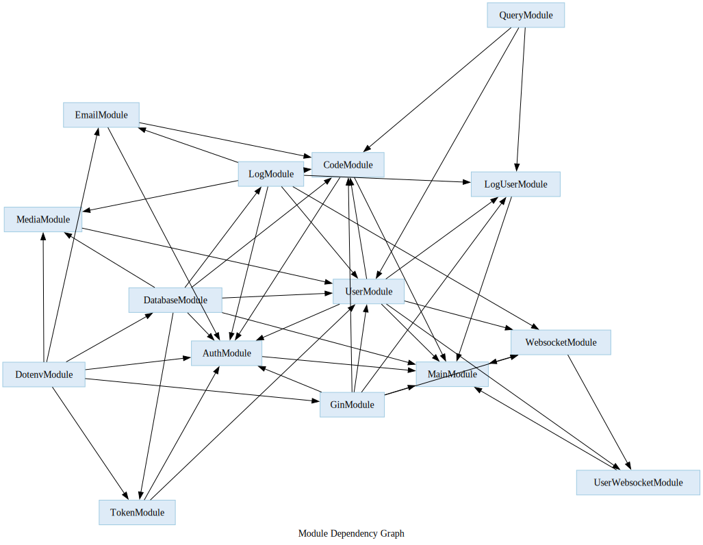

# Golang module template

## Description

This project is a REST API template in Go using module and dependency injection.

## Technologies used

- [Go](https://golang.org/)
- [Swag](https://github.com/swaggo/swag)
- [Docker](https://www.docker.com/)
- [Docker Compose](https://docs.docker.com/compose/)
- [Graphiz](https://graphviz.org/)

## Project initialization

1. Clone the repository:
```bash
git clone https://github.com/LordPax/golang-module-template.git
```

2. Navigate to the project directory:
```bash
cd golang-module-template
```

3. Start the Docker containers:
```bash
docker-compose up
```

## Backend installation

1. Create a `.env` file in the root of the `back` directory and add the following environment variables:
```bash
NAME='Golang Api'
DOMAIN=localhost:8080
PORT=:8080
GIN_MODE=debug
ALLOWED_ORIGINS='*'

DB_HOST=localhost
DB_USER=root
DB_PASSWORD=root
DB_NAME=golang-app
DB_PORT=5432

COOKIE_SECURE=false
JWT_SECRET_KEY=secret

BREVO_API_KEY=
BREVO_SENDER=noreply@example.com

OS_CLOUD=openstack
```

2. Install dependencies:
```bash
go mod download
go mod vendor
```

3. Build the project:
```bash
swag init
go build
```

4. Migrate the database:
```bash
./golang-api call db:migrate
./golang-api call db:fixtures # optional
```

5. Start the server:
```bash
./golang-api
```

## Module dependencies graph

### Generate graph

1. Install `graphviz`:
```bash
sudo apt-get install graphviz
```
```bash
sudo pacman -S graphviz
```

2. Generate the dependencies graph:
```bash
./golang-api graph
sfdp -Tsvg -o example/graph.svg example/graph.dot
```

### Graph


